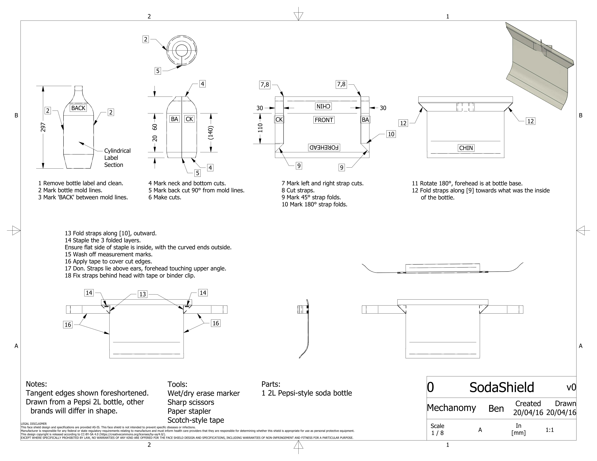

# SodaShield
Convert a 2L soda bottle into a face shield using only scissors and a stapler.
See assembly instructions in [SodaShield.pdf](SodaShield.pdf).

# License
This design copyright is released according to CC-BY-SA 4.0 (https://creativecommons.org/licenses/by-sa/4.0/).

# Legal Disclaimer
This face shield design and specifications are provided AS-IS. This face shield is not intended to prevent specific diseases or infections.
Manufacturer is responsible for any federal or state regulatory requirements relating to manufacture and must inform health care providers that they are responsible for determining whether this shield is appropriate for use as personal protective equipment.
This design copyright is released according to CC-BY-SA 4.0 (https://creativecommons.org/licenses/by-sa/4.0/).
EXCEPT WHERE SPECIFICALLY PROHIBITED BY LAW, NO WARRANTIES OF ANY KIND ARE OFFERED FOR THE FACE SHIELD DESIGN AND SPECIFICATIONS, INCLUDING WARRANTIES OF NON-INFRINGEMENT AND FITNESS FOR A PARTICULAR PURPOSE.
